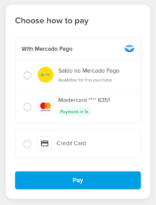

# Fast payments with Mercado Pago

This project demonstrates integration with Mercado Pago's Fast Payments, including the handling of saved payment methods and the collection of CVV.



## Project Structure

```
.├── index.html              # Main HTML document, user interface
├── css/
│   └── style.css           # Styles for the application
├── js/
│   ├── mercadoPago.js      # Mercado Pago SDK interaction logic (encapsulated in window.MPAuthenticator)
│   └── script.js           # DOM manipulation, UI logic, calls to MPAuthenticator
└── README.md               # This documentation
```

## Configuration

Before running the application, you need to configure the following placeholders with your actual values:

### 1. Mercado Pago Public Key

In `js/mercadoPago.js`, replace the placeholder with your actual Mercado Pago public key:

```javascript
const publicKey = "<YOUR_PUBLIC_KEY>"; // Replace with your actual public key
```

### 2. Payer Information

In `js/script.js`, replace the placeholders with the actual payer information:

```javascript
const payerEmail = "<PAYER_EMAIL>"; // Replace with the payer's email address
const totalAmount = "<TOTAL_AMOUNT>"; // Replace with the payment amount (e.g., "100.00")
```

**Important**:

- The public key should be your Mercado Pago public key (starts with `APP_USR-` for production or `TEST-` for testing)
- The payer email should be a valid email address
- The total amount should be a string representing the payment amount in your currency

## JavaScript Implementation Details

The Mercado Pago interaction logic is centralized in the `js/mercadoPago.js` file. This file defines a global object `window.MPAuthenticator` that encapsulates all calls to the Mercado Pago SDK and related flow logic. The main responsibilities of `MPAuthenticator` include:

- **`MPAuthenticator.initializeAuthenticator(amount, payerEmail)`**: Called on page load (by `script.js`) to initialize the `mp.authenticator(amount, payerEmail)` and stores the `authenticatorInstance`.
- **`MPAuthenticator.getAuthorizationToken()`**: Uses the stored `authenticatorInstance` to call `authenticatorInstance.show()` and returns the `authorizationToken`.
- **`MPAuthenticator.getAccountPaymentMethods(authorizationToken)`**: Fetches the payment methods available to the user.
- **`MPAuthenticator.getCardId(authorizationToken, selectedPaymentMethodToken)`**: Gets the ID of a saved card.
- **`MPAuthenticator.createSecureField(cardData, cvvContainerId)`**: Creates and mounts the Mercado Pago Secure Field for CVV collection.
- **`MPAuthenticator.getCardToken(cardId)`**: Generates a card token (`cardToken`) from the card ID and the CVV entered in the Secure Field.
- **`MPAuthenticator.updatePaymentMethodToken(authorizationToken, selectedPaymentMethodToken, cardToken)`**: Updates the saved card's token (pseudotoken) with the newly generated `cardToken`.
- Exposes the main SDK instance: `MPAuthenticator.mp`.

The `js/script.js` file is responsible for:

- Initializing the authenticator on page load by calling `MPAuthenticator.initializeAuthenticator`.
- Orchestrating the display of payment methods: initially showing a trigger, then upon click, calling `MPAuthenticator.getAuthorizationToken` followed by `MPAuthenticator.getAccountPaymentMethods`.
- Manipulating the DOM to render the initial trigger, payment methods, input fields (like the CVV container and installment selector).
- Managing the user interface state (e.g., which payment method is selected, handling loading states).
- Handling user feedback (alerts, error messages).

## How to Run

1.  Clone this repository (if applicable).
2.  Navigate to the project directory.
3.  Open the `index.html` file directly in a modern web browser.

    **Note**: Due to how the Mercado Pago SDK and payment interactions work, some functionalities (especially those depending on a valid `authorizationToken` and real-time interactions) may behave in a limited or simulated manner without a real backend and an HTTP/HTTPS server context. However, the frontend structure and SDK calls are configured according to best practices for secure CVV collection.

This README aims to provide a clear guide to the structure and flow of the Mercado Pago integration in this example project.
